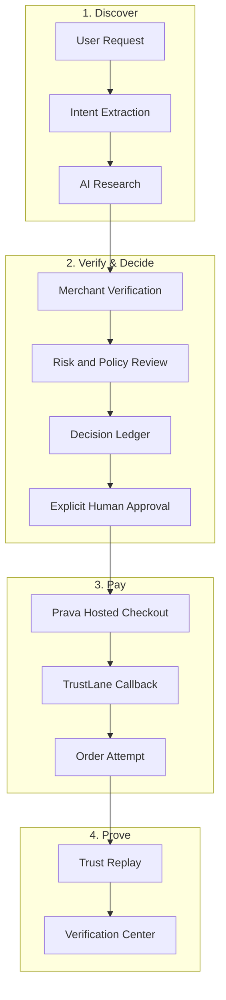

# TrustLane

### The Trust Layer for Agentic Commerce

Research → Verify → Explain → Approve → Pay → Prove

TrustLane is an AI-assisted shopping workspace that verifies merchants, explains recommendations, requires explicit human approval, completes secure hosted checkout through Prava, and preserves an auditable commerce trail.

## 🎥 Demo Video

[](https://www.youtube.com/shorts/jphPNkMn8B0?si=ARit2BtE3gyw9yim)

### 🎥 Watch the 2-minute TrustLane walkthrough

The demo showcases:

- AI merchant research
- Transparent Decision Ledger
- Prava Hosted Checkout
- Authorization status
- Order history with downloadable receipts
- Live Judge Verification Pack

## 📸 Product Gallery

### Dashboard


TrustLane Dashboard — the AI commerce control center.

### Decision Ledger


Decision Ledger — every recommendation is fully explainable.

### Hosted Checkout

)

Prava Hosted Checkout integrated into the TrustLane workflow.

### Payment Status


Payment authorization recorded without claiming merchant completion.

### Order History


Downloadable receipts and complete order history.

## 🔗 Quick Links

- [🌐 Live Demo](https://trustlane-pi.vercel.app)
- [🎥 Demo Video](https://www.youtube.com/shorts/jphPNkMn8B0?si=ARit2BtE3gyw9yim)
- [📦 GitHub Repository](https://github.com/chyokore/Trustlane)
- [📄 Evidence Pack](https://trustlane-pi.vercel.app/evidence)
- [📑 Judge Verification Page](https://trustlane-pi.vercel.app/evidence)

[Try TrustLane](https://trustlane-pi.vercel.app) · [Watch the Demo](https://www.youtube.com/shorts/jphPNkMn8B0?si=ARit2BtE3gyw9yim) · [Verify the Evidence](https://trustlane-pi.vercel.app/evidence) · [Review the Source](https://github.com/chyokore/Trustlane)

## Verify TrustLane in 90 Seconds

- [Live App](https://trustlane-pi.vercel.app)
- [Demo Video](https://www.youtube.com/shorts/jphPNkMn8B0?si=ARit2BtE3gyw9yim)
- [Public Evidence Pack](https://trustlane-pi.vercel.app/evidence)
- [Latest Research](https://trustlane-pi.vercel.app/demo-data/latest-research.json)
- [Decision Ledger](https://trustlane-pi.vercel.app/demo-data/latest-decision-ledger.json)
- [Agent Execution Log](https://trustlane-pi.vercel.app/demo-data/agent-execution-log.json)
- [Order Attempt](https://trustlane-pi.vercel.app/demo-data/latest-order-attempt.json)
- [Verification Lifecycle](https://trustlane-pi.vercel.app/demo-data/verification-lifecycle.json)
- [Trust Replay](https://trustlane-pi.vercel.app/demo-data/trust-replay.json)
- [Merchant Passport](https://trustlane-pi.vercel.app/demo-data/merchant-passport.json)
- [GitHub Source](https://github.com/chyokore/Trustlane)

1. Open the Evidence Pack.
2. Review AI research and merchant verification.
3. Inspect the ranked Decision Ledger.
4. Confirm explicit human approval before checkout.
5. Review the Prava sandbox order state.
6. Inspect Verification Lifecycle and Trust Replay.
7. Compare public artifacts with the source code.

| Proof | Status | Public Artifact |
| --- | --- | --- |
| AI research | Verified demo record | latest-research.json |
| Merchant verification | Structured evidence | merchant-passport.json |
| Transparent reasoning | Decision Ledger | latest-decision-ledger.json |
| Human approval | Recorded | trust-replay.json |
| Prava Hosted Checkout | Sandbox execution | latest-order-attempt.json |
| Payment completion | Not inferred | latest-order-attempt.json |
| Verification timeline | Recorded | verification-lifecycle.json |
| Cross-device demo | Supported | README guest-data section |

> Publication status: the public pack is generated from a genuine sanitized browser export. Its recorded Prava state is `Authorized / Awaiting Merchant Execution`; payment completion is not inferred.

## What Is Real

- Live OpenAI orchestration
- Integrated Senso merchant context
- Genuine Prava sandbox hosted checkout
- OTP/passkey authorization
- Callback handling
- Recorded order attempts
- Recorded verification lifecycle
- An offline public-artifact pipeline designed for a genuine exported demo journey

## What Is Not Claimed

- No real funds moved
- No inferred payment completion
- `Authorized / Awaiting Merchant Execution` is not treated as completed
- Curated merchant origins are not represented as Senso verification
- No sensitive payment credentials are published
- Guest browser history is not globally synchronized without export/import

## Problem

AI can find products and initiate purchases quickly, but trustworthy commerce requires more than speed. Users need evidence that a merchant is legitimate, a transparent explanation of why one option was selected, explicit control before money moves, secure payment handling, and an auditable record of the outcome.

## Solution

TrustLane creates a reviewable trust layer around AI-assisted purchasing. It gathers evidence, verifies merchants with Senso, evaluates risk and policy constraints, produces a transparent Decision Ledger, pauses for human approval, redirects to Prava Hosted Checkout, and records authentic payment lifecycle states for post-purchase verification and replay.

## Core Workflow



## Product Capabilities

- Structured shopping intent extraction and AI research using the OpenAI Responses API
- Senso-backed merchant verification and visible evidence sources
- Risk, policy, warranty, return, and trade-off review
- A Decision Ledger explaining the selected recommendation
- Explicit human approval before checkout
- Prava Hosted Checkout with server-side session creation
- Authentic `pending`, `awaiting_result`, `completed`, and `failed` states
- Persistent order attempts, downloadable receipt JSON, and Trust Replay
- Merchant Passport and Verification Center for auditability

## Payment Lifecycle Integrity

TrustLane never fabricates payment success. A hosted session or successful cardholder authorization is not treated as a completed purchase.

| Prava state | TrustLane state | Meaning |
| --- | --- | --- |
| `pending` | Sandbox Pending | Secure checkout is still processing |
| `awaiting_result` | Authorized / Awaiting Merchant Execution | Authorization is complete; merchant execution is not final |
| `completed` | Completed | Payment and merchant execution completed |
| `failed` | Failed | Checkout reached a terminal failure |

Only `completed` produces a successful Trust Receipt and confirmed Senso outcome record.

## Architecture

| Layer | Technology and responsibility |
| --- | --- |
| Web application | Next.js 15 App Router, React 19, TypeScript, Tailwind CSS |
| AI orchestration | OpenAI Responses API with structured server-side output |
| Merchant trust | Senso verification context and evidence |
| Payments | Prava Hosted Checkout and server-side result polling |
| Audit layer | Decision Ledger, order attempts, receipt JSON, Trust Replay |
| Persistence | Safe browser-local metadata; no card data, API keys, or session credentials |
| Deployment | Vercel |

Sensitive provider credentials remain server-side. TrustLane does not store card numbers, CVV values, OTPs, passkey information, API keys, or one-time payment credentials.

## Application Routes

| Route | Purpose |
| --- | --- |
| `/` | Product overview and judge entry point |
| `/dashboard` | TrustLane dashboard |
| `/dashboard/shop` | Research, recommendation, approval, and hosted checkout |
| `/dashboard/agents` | Agent workflow overview |
| `/dashboard/decision-ledger` | Recommendation reasoning and trade-offs |
| `/dashboard/orders` | Persistent checkout attempts and lifecycle states |
| `/dashboard/saved` | Saved research products |
| `/dashboard/settings` | Local preferences |
| `/dashboard/verify` | Merchant Passport, evidence, replay, and receipts |
| `/dashboard/checkout/complete` | Hosted checkout callback reconciliation |
| `/docs` | In-app technical documentation |

## Guest Data & Cross-Device Demo

TrustLane operates in guest mode for the hackathon. Research, Decision Ledger data, merchant evidence, order attempts, verification events, saved products, and preferences are intentionally stored in the current browser rather than synchronized through an account or cloud database.

Activity created on another browser or device does not appear automatically. Use **Export Demo State** in Settings or Verification Center, then **Import Demo State** on the destination browser to merge the safe demo history with its existing local activity. Newer records are preserved and duplicate attempts are matched by their safe identifiers.

Exports never include customer email addresses, API keys, access tokens, Prava session tokens, card data, CVV, OTP values, passkeys, payment credentials, or callback secrets. Import and export are client-side operations and do not call OpenAI, Senso, Prava, or any TrustLane API route.

## Local Development

### Prerequisites

- Node.js 20 or newer
- npm
- Sandbox credentials for the integrations you intend to exercise

### Setup

```bash
git clone https://github.com/chyokore/Trustlane.git
cd Trustlane
npm install
```

Create `.env.local` and provide the required credentials. Never commit this file.

```env
OPENAI_API_KEY=
OPENAI_MODEL=
SENSO_API_KEY=
PRAVA_SECRET_KEY=
NEXT_PUBLIC_PRAVA_PUBLISHABLE_KEY=
NEXT_PUBLIC_APP_URL=https://trustlane-pi.vercel.app
```

Start the development server:

```bash
npm run dev
```

Production validation:

```bash
npx tsc --noEmit
npm run lint
npm run build
```

These static commands do not create a Prava session or transaction.

## Judge Demo

1. Open the [live application](https://trustlane-pi.vercel.app) and continue to the shopping workspace.
2. Enter a natural-language product request and review the structured intent.
3. Inspect researched products, merchant evidence, risk signals, and the Decision Ledger.
4. Confirm that checkout requires explicit approval and a genuine customer email.
5. Continue to Prava Hosted Checkout using the assigned sandbox card.
6. Return through the callback and inspect the authentic lifecycle state in Orders.
7. Open Verification Center to review the Merchant Passport, Trust Replay, evidence, and receipt JSON.

No real funds move in sandbox mode. Do not describe `awaiting_result` as a completed payment.

## Documentation and Public Links

- [Live application](https://trustlane-pi.vercel.app)
- [YouTube demo](https://www.youtube.com/shorts/jphPNkMn8B0?si=ARit2BtE3gyw9yim)
- [Judge demo script](docs/demo-script.md)
- [Submission summary](docs/submission-summary.md)
- [Privacy policy](https://trustlane-pi.vercel.app/privacy)
- [Terms](https://trustlane-pi.vercel.app/terms)

## Hackathon Submission

TrustLane was built for the Agentic Commerce Hackathon to demonstrate that autonomous commerce can remain evidence-driven, human-controlled, secure, and auditable from request through final outcome.
